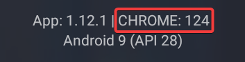

<h1>WebView 电视 FAQ</h1>

以下列举了开发者以往被常问到的一些问题，使用时出现问题的用户，请先参照这篇文章自行解决。 
如果依然无法解决你的问题，请前往 [此issue](https://github.com/hxh19950701/WebViewTvLive/issues/94) 和其他用户一起讨论。 
有过自行解决问题经验的用户，欢迎在 Issues 区留下您的解决方案，来帮助其他用户。 

**Q: 在我的电视机/盒子上无法自动全屏？** 
一般是系统 WebView 出现了问题，请先确定系统 WebView 的类型和版本。 
按返回键或长按屏幕，打开左侧边栏。在 App 版本后面，会显示 WebView 的类型和版本。 
如下图所示（WebView 类型是 CHROME，版本是 124）。 
 
接下来，按下表解决问题。 
| 代号   | 名称 | 解释 | 解决方式 |
|--------|-----------------|-----------------------------------------------------|------------------------------------------------------------------------------------------------------------------------------------------|
| AW     | Android WebView | 设备厂商自编译的 WebView，很难更新 | ● 版本过低，升级系统 WebView（如果厂商还提供更新）。  ● 更换成 Google WebView（比较困难，一般需要 Root 或反编译）。  ● 打开“全屏兼容模式”。  ● 使用 X5 内核。 |
| GW     | Google WebView  | Google 提供的 WebView| ● 版本过低，升级系统 WebView（[可从这里获取](https://www.apkmirror.com/apk/google-inc/android-system-webview/)）。  ● 使用 X5 内核。            |
| HWW    | Huawei WebView  | Huawei 提供的 WebView | 暂无 |
| AMW    | Amazon WebView  | Amazon 提供的 WebView  | 暂无 |
| CHROME | Google Chrome | Chrome 作为 WebView | 一般不会出现无法全屏的问题 |
| UKN | 未知 WebView | 系统 WebView 工作不正常 | ● 安装或更换成 Google WebView。  ● 使用 X5 内核。 |
| X5 | 腾讯 X5 | X5 WebView | 一般不会出现无法全屏的问题 |

注： 
1. 如果版本小于 78，则属于版本过低。 
2. “全屏兼容模式” 仅对 AW 有作用，其他情况请勿开启。 
 

**Q: 怎么打开“全屏兼容模式”？** 
A: 按返回键打开左侧边栏，进入设置，将“全屏兼容模式”选项打开即可。 
 

**Q: 我如何安装使用 X5 内核？** 
A: 按返回键打开左侧边栏，进入设置，将“WebView 实现”改为 X5，然后进入“TBS 调试界面”，选择“安装线上内核”即可。 
请注意 TBS 调试界面没有选中状态，遥控器用户可以盲操作：按两下右键，再按确定键。 
 

**Q: 在 TBS 调试界面“安装线上内核”老是失败？** 
A: 可能刚好遇到了官方 X5 内核下载限流时间段，请换个时间段重试。参见[《关于官网X5内核SDK加载不稳定问题说明》](https://doc.weixin.qq.com/doc/w3_AGoAtwbdAFwlo0hmqkbTl6p19tCOV)。 
 

**Q: 在我的海信电视上安装 X5 内核会闪退？** 
A: 部分海信电视没有 /sdcard 分区导致的。需要将应用安装到U盘上，X5 内核安装才能成功。 
 

**Q: 使用 X5 内核后，软件运行异常（花屏，闪退，按键失效，卡死等）？** 
A: X5 内核对你的设备支持不好，还是切换回系统 WebView 吧。 
 

**Q: 访问央视网提示“您当前的浏览器不支持视频播放，请升级浏览器或更换设备（如果是360、 QQ 或搜狗浏览器，须使用极速模式观看）”？** 
A: 系统 WebView 版本太低，升级或使用 X5 内核即可解决。 
 

**Q: 尝试了以上所有的办法，在我的设备上依然闪退/无法自动全屏？** 
A: 请去这里反馈。https://github.com/hxh19950701/WebViewTvLive/issues/94 
 

**Q: 换台速度特别慢，能不能优化？** 
A: 应用的工作原理决定了换台速度不会快。换台速度取决于设备的性能，无法优化。对于低性能的设备，在设置内打开“无图模式”，或许可以得到些许的性能提升。 
 

**Q: 安装时提示“软件包解析失败”？** 
A: 因为你的设备系统是很老的 4.x 版本，建议还是花点小钱升级一下。 
 

**Q: 有没有适配 Android 5.0 以下设备的打算？** 
A: 没有这个打算。这些设备的性能通常都不高，WebView 版本也比较老而且无法升级，即便适配了，也无法使用。 
 

**Q: 一些网站需要登录才能观看/获取更高清晰度，怎么登录？** 
A: 点击屏幕右侧或按菜单键打开右侧边栏，点击地球图标可以打开源网页，在这个界面你可以操作源网页来进行登录操作。 
 