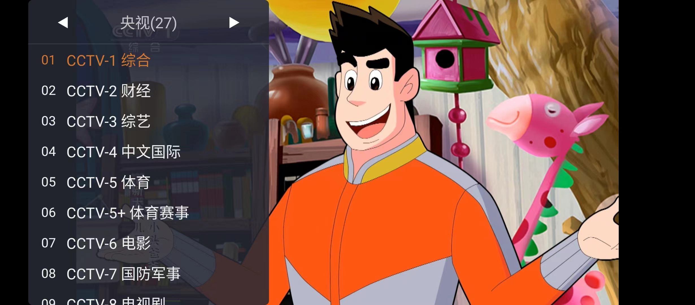
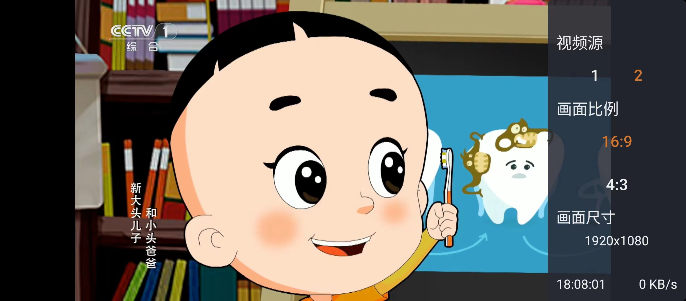

    <h1>WebView 电视</h1>

    
使用 腾讯X5 WebView 开发的电视直播App

    
原理：加载官方直播网页，识别网页中的video标签自动全屏。

    

 

## 功能

- 自动更新频道列表
- 多直播源
- 播放异常自动换源/刷新
- 应用自定义设置
- 适配手机、平板和电视

## 下载
- 从 Github 下载  
https://github.com/hxh19950701/WebViewTvLive/releases  
- 微信  
若您不方便访问 Github， 也可关注微信公众号“网页电视”，回复任意消息即可获取最新版下载链接。

## 优势

- 直接使用官网直播链接，非常稳定可靠
- 兼容 m3u8 链接

## 局限

- 比起直接加载直播源，载入频道稍长，需要等待一定时间
- 使用的是网页播放器播放，对设备性能有一定的要求
- 无法选择视频清晰度

## FAQ

**Q: 在电视机/盒子上无法自动全屏？**
 
A: 一般是设备 WebView 的问题，待X5内核下载完成，重启 App 即可。若无法自动下载X5内核，请在设置-TBS调试界面内手动安装。
 
 
**Q: 我打开怎么只有CCTV-1？**
 
~~A: 频道列表托管在Github，出现此问题请检查您与Github之间的连接。~~
 
最新的版本应该不会出现这样的问题了。

## 注意
- 请尊重作者，源码仅供您学习、交流使用。 
- 若您二次打包了我的应用，请自用，或者在注明原App名称的情况下适度分享。 
- 不要利用此项目牟利。 

## 捐赠
如果 App 对您有帮助，请捐赠作者。作者会更积极的维护此项目！

